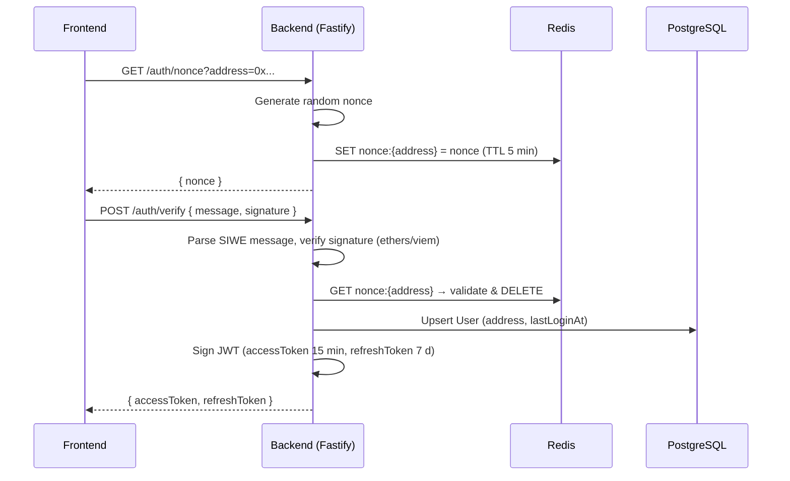
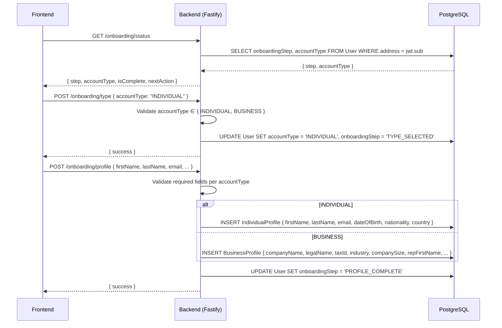
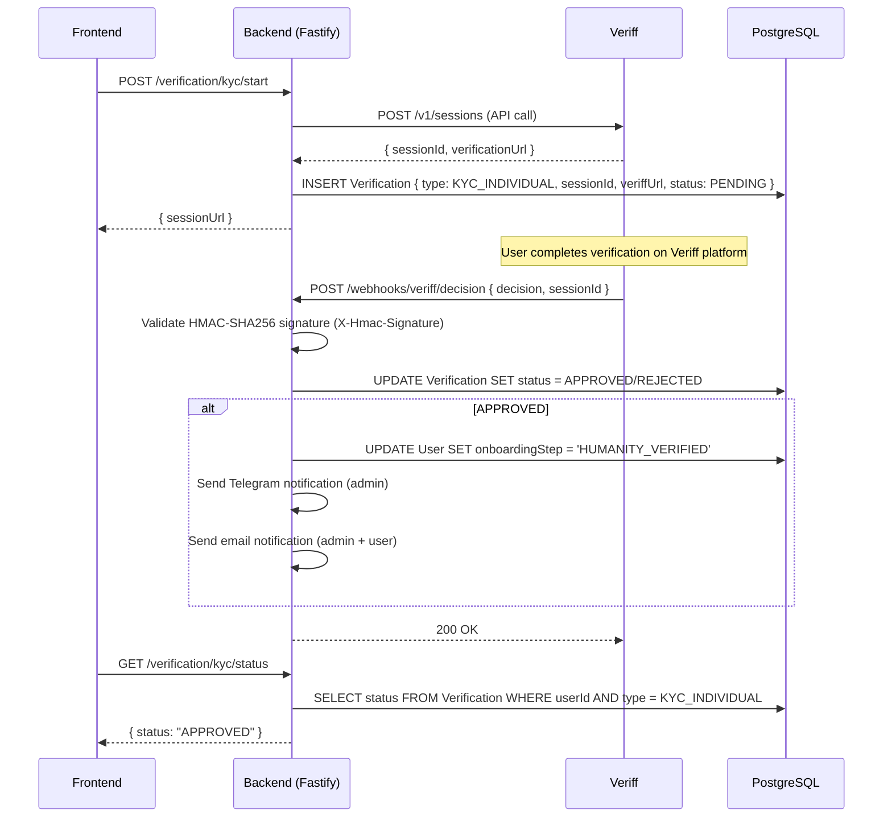
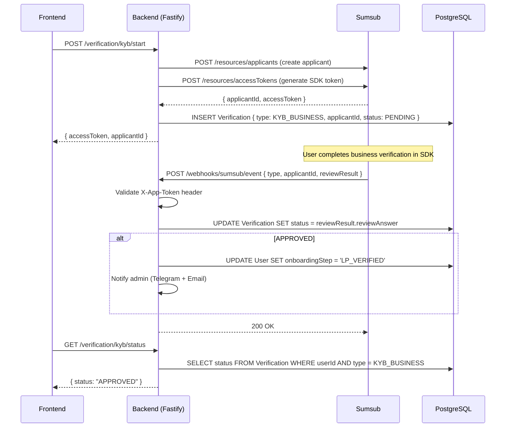
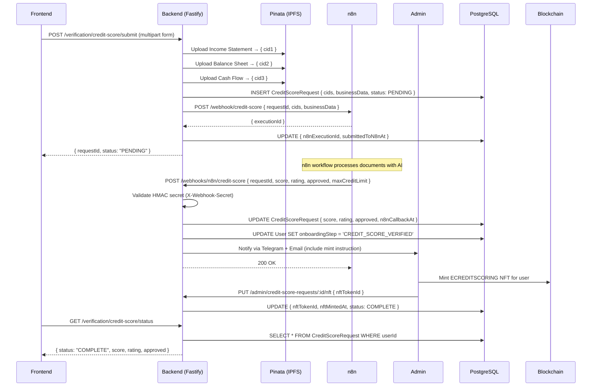
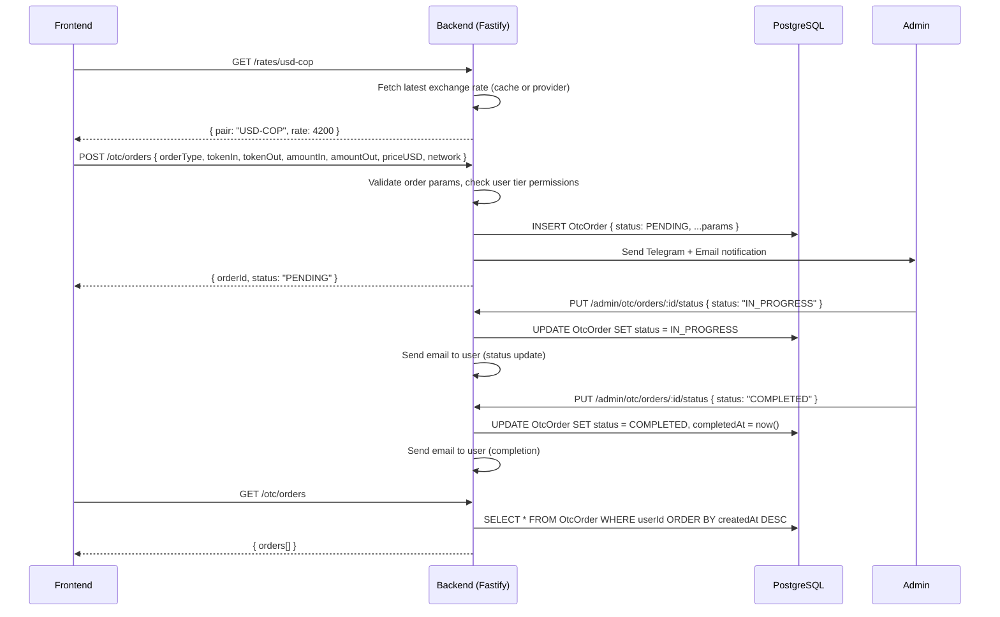
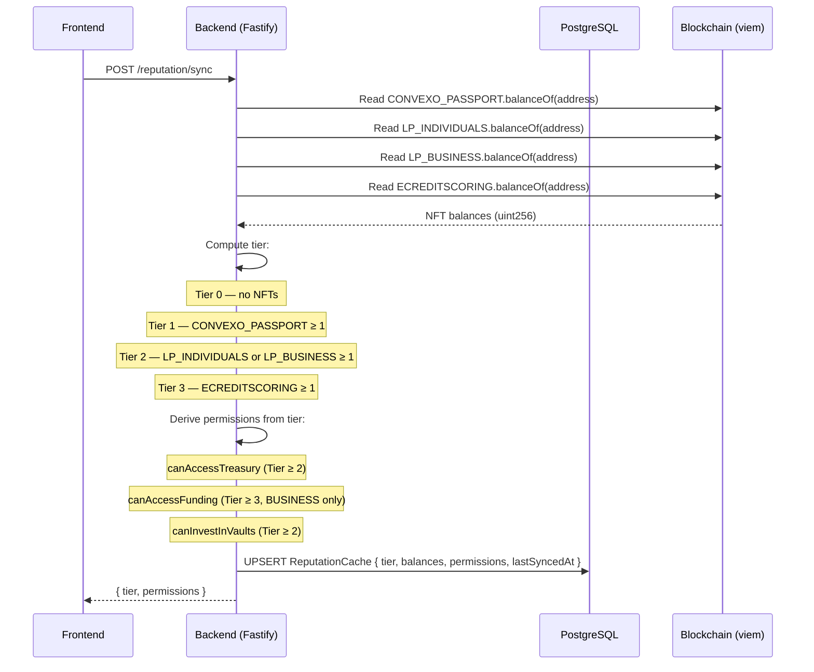
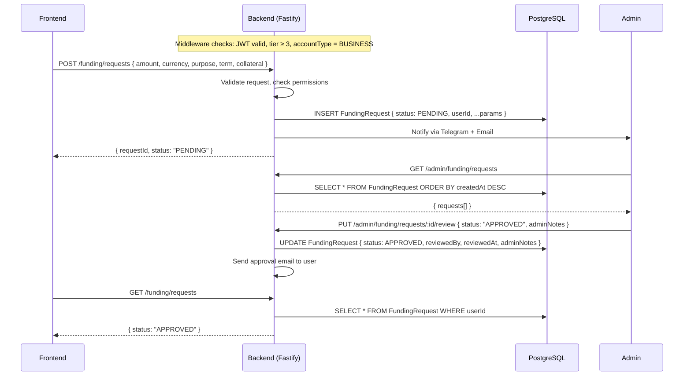
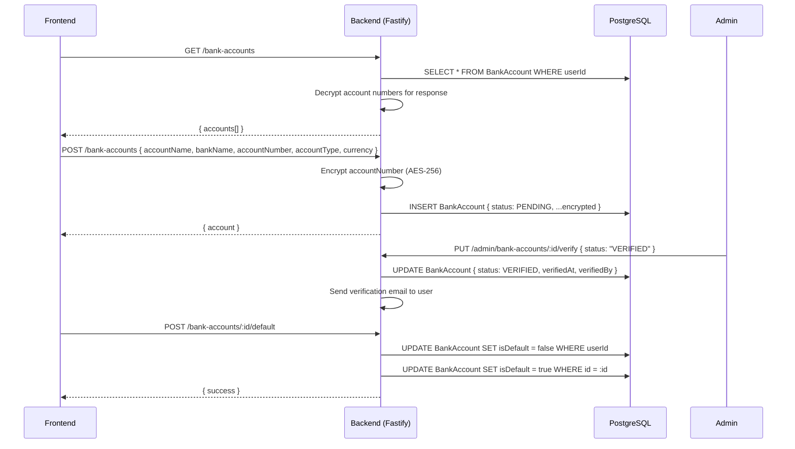
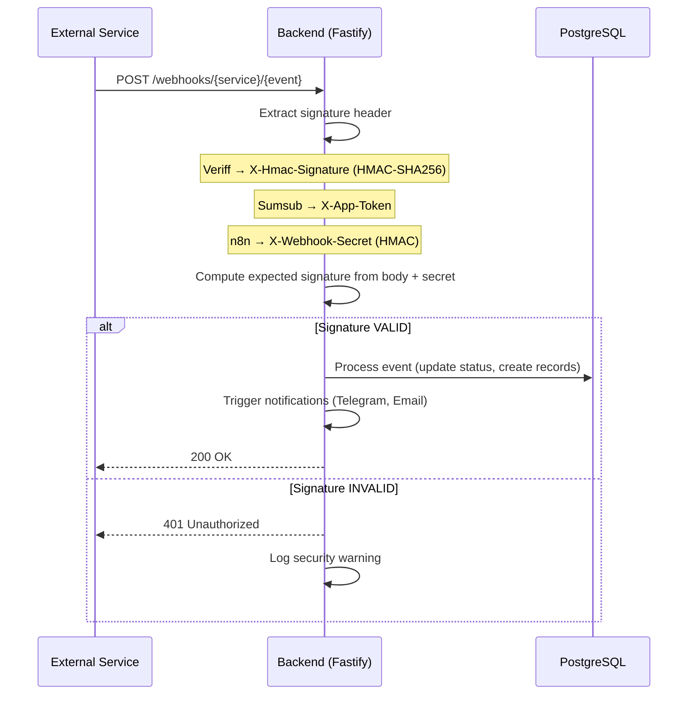

# Convexo Backend — Sequence Diagrams

> API processing, database operations, webhooks and external service integrations.  
> Updated: 2026-03-04

---

## 1. SIWE Authentication (Server-Side)



---

## 2. Onboarding API Processing



### Onboarding Step State Machine

```
NOT_STARTED → TYPE_SELECTED → PROFILE_COMPLETE → HUMANITY_VERIFIED
→ LP_VERIFIED → CREDIT_SCORE_SUBMITTED → CREDIT_SCORE_VERIFIED → COMPLETE
```

---

## 3. KYC Processing (Individual — Veriff)



---

## 4. KYB Processing (Business — Sumsub)



---

## 5. Credit Score Pipeline (Business — n8n)



---

## 6. OTC Order Management



---

## 7. Reputation Sync (Blockchain → DB)



---

## 8. Funding Request Processing (Business, Tier 3)



---

## 9. Bank Account Management



---

## 10. Webhook Security

All inbound webhooks follow a consistent validation pattern:



| Service | Webhook URL | Header | Algorithm |
|---------|-------------|--------|-----------|
| Veriff | `/webhooks/veriff/decision` | `X-Hmac-Signature` | HMAC-SHA256 |
| Sumsub | `/webhooks/sumsub/event` | `X-App-Token` | Token match |
| n8n | `/webhooks/n8n/credit-score` | `X-Webhook-Secret` | HMAC |
